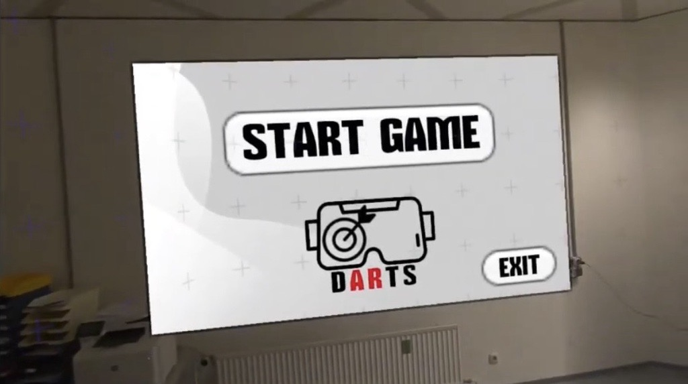
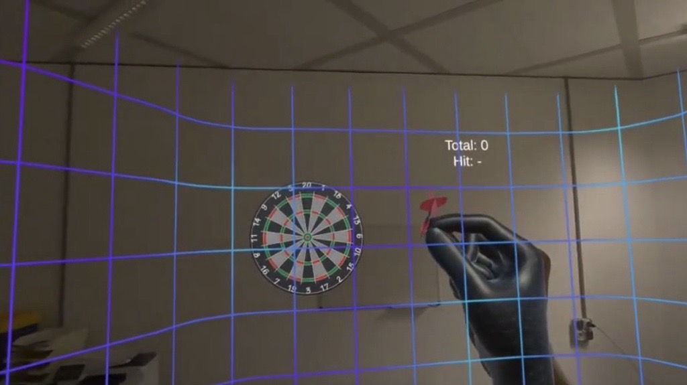
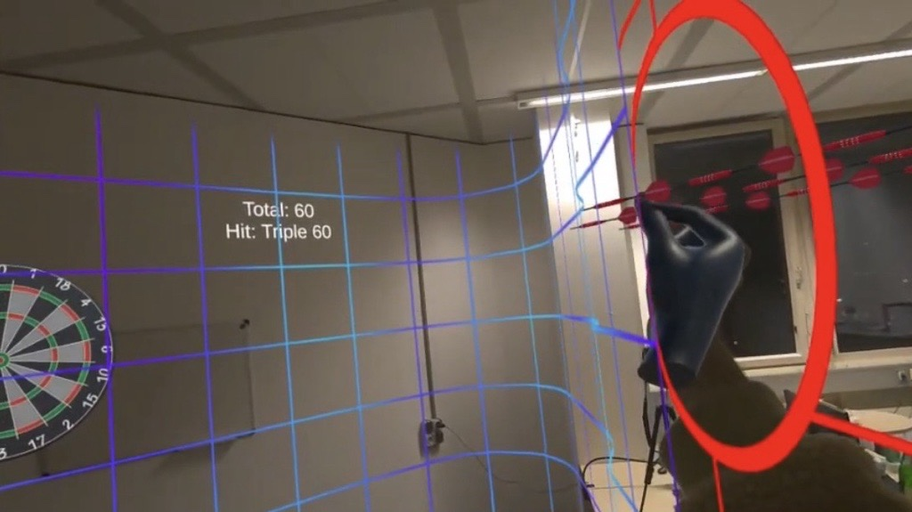
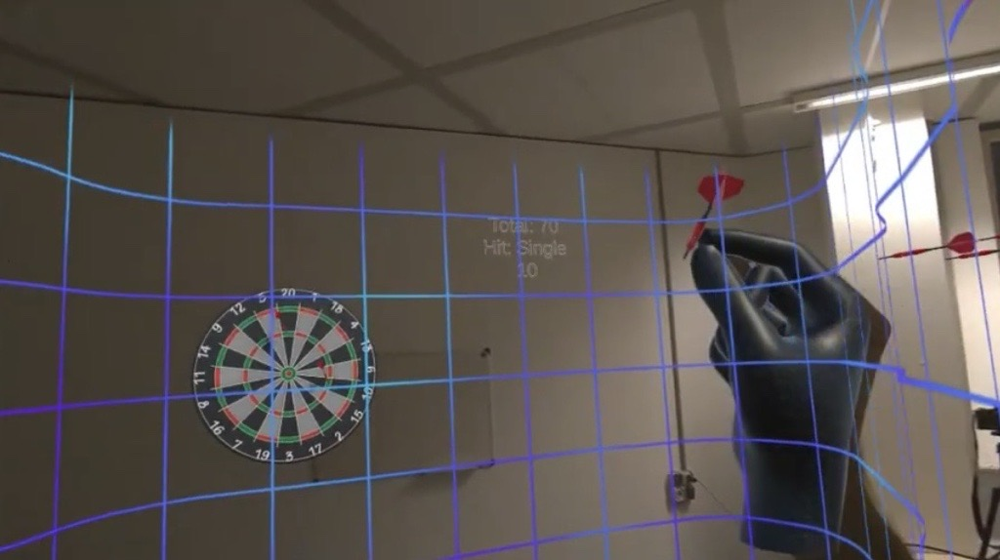
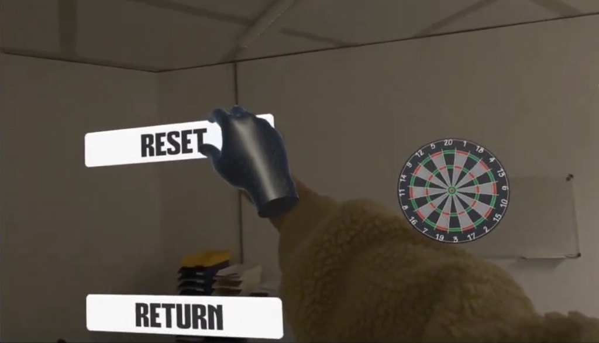
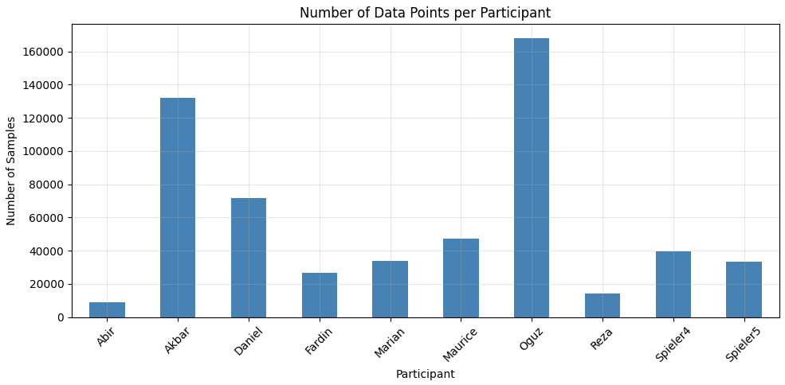
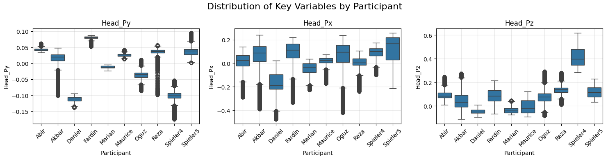
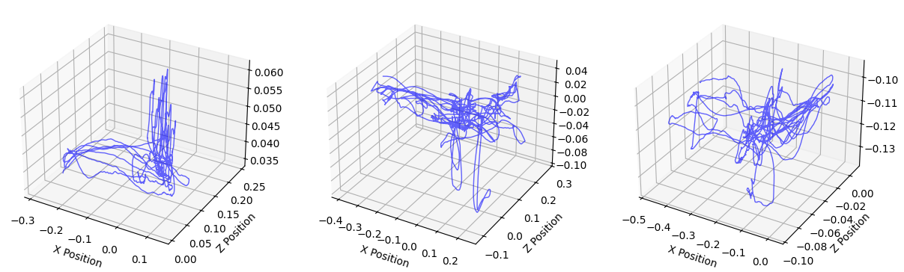
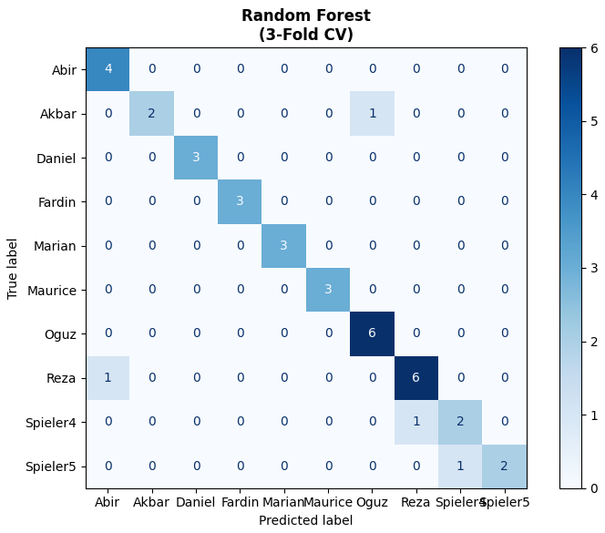
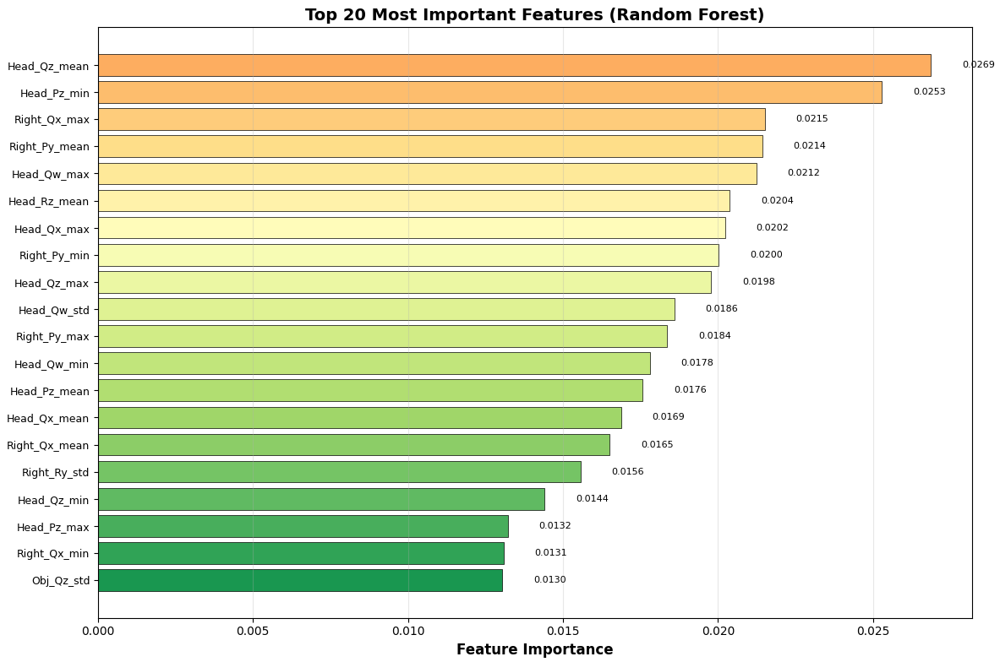

# Biometric User Identification in AR Mini-Game

## Authors
* **Rezaul Hoque**
* **Md Aminul Islam**

---

## 1. Situation
Within the scope of the second Usable Security Lab, an Augmented Reality (AR) mini-game was successfully implemented using Unity 2022 for the Meta Quest 3 standalone headset [cite: 2]. The primary goal was to design and deploy a brief, 30-second interaction scenario capable of recording user behavioral data for biometric evaluation and machine-learning-based identification [cite: 1, 2]. 

To achieve a clean blend of habituation and distinctiveness, a physics-based dart-throwing scenario was constructed [cite: 2]. Players pick up a virtual dart using controllers or hand-tracking, aim at a physical/virtual dartboard mapped into their space, and execute a throw toward the target [cite: 2]. The core objective of the interaction layout was to design a simple, routine movement pattern that becomes intuitive after just a few attempts, while preserving deep, un-spoofable personal distinctiveness to support continuous user authentication through behavioral tracking [cite: 2].

---

## 2. Obstacle
Building a high-accuracy, reliable identification system from rapid physical movements required overcoming several human-computer interaction (HCI), physics-simulation, and data-processing bottlenecks:
* **Tracking Jitter and Dropouts:** Small raw tracking fluctuations or brief loss-of-tracking instances (such as pinch-flickering during hand tracking) frequently caused accidental premature releases or highly inconsistent dart throws, destroying the immersive experience and degrading data consistency [cite: 2].
* **Varying Trial Durations:** Individual dart throws and user sessions inherently varied in physical duration, meaning raw observational lengths differed. This prevented a direct, uniform shape matrix for standard machine learning classification models [cite: 2].
* **Physical Biases:** Large height and physical stature differences among the 10 separate testing participants created biological skewing, which threatened to dominate the statistical feature weights and completely overshadow the subtler behavioral biometric signatures [cite: 2].
* **Physics Tuning:** Initial uncalibrated configurations felt either too artificial (arcade-like) or completely unpredictable, lacking the realism required for natural, highly repeatable human throwing movements [cite: 2].

---

## 3. Action
To systematically neutralize the obstacles, a comprehensive software architecture, unified user study protocol, and advanced machine learning preprocessing pipeline were developed:

### System Development & Physics Tuning
* **Aerodynamic Stabilization:** Implemented a unique physics-based dart flight logic where the rigid body automatically realigns its forward rotation along its directional velocity vector mid-air, ensuring intuitive, predictable trajectories [cite: 2].
* **Input Smoothing:** Applied velocity smoothing algorithms to grab-and-throw actions to filter device tracking jitter and introduced a brief temporal filter to ignore short-term pinch-flickers during hand-tracking [cite: 2].
* **Feedback Systems:** Integrated precise collision logic at the dartboard bounds to calculate and render hit scores, combined with 2D background tracks and spatial 3D audio effects for distinct throw and impact feedback [cite: 2].

### Gameplay Interface & User Experience Visualizations
The visual look, core features, and interactive flow of the application are represented below by 5 mixed-reality screenshots from the application runtime environment:

* **Main Menu / Game Initialization (`dart5.jpg`):** Displays the introductory interface panel anchored into the user's mixed reality room. It features a minimalist clean environment configuration with a "START GAME" option and an "EXIT" button accompanying the core headset-tracked "DARTS" logo [cite: 2].



* **Dart Pickup and Initial Aiming (`dart1.jpg`):** Shows the initial interactive phase where the system initializes hand-tracking and generates a stylized virtual glove tracking the user's grip [cite: 2]. A protective geometric grid overlay bounds the spatial workspace, while the real-time HUD scoreboard initializes at "Total: 0" and "Hit: -" [cite: 2].



* **Dynamic Throwing & Spatial Guidance Tracking (`dart2.jpg`):** Illustrates the throw release phase. Velocity smoothing filters out any tracking noise as the player releases the stabilized dart toward the target [cite: 2]. Active tracking outlines and a red spatial target boundary overlay guide human focus, and the points display updates immediately upon hit registration (e.g., "Total: 60", "Hit: Triple 60") [cite: 2].



* **Target Accuracy and Scoring Loops (`dart3.jpg`):** Visualizes successive interactive loops where multiple stabilized darts adhere directly to the target sectors via collision mechanics [cite: 2]. The real-time scoring overlay dynamically updates running totals (e.g., "Total: 70", "Hit: Single 10") [cite: 2].



* **System Control Overlays / Game Options (`dart4.jpg`):** Showcases the secondary administrative option deck available during and after the trial session, giving players access to "RESET" the current testing frame or "RETURN" to the default system menu [cite: 2].



### User Study & Data Collection
* **Study Execution:** Conducted a comprehensive study with 10 separate participants [cite: 2]. Each participant completed 4 discrete rounds consisting of 3 throws each, yielding a verified training dataset of 38 complete session records [cite: 2].
* **Session Logging:** Data logging scripts captured real-time positional and rotational transform matrices across 40 distinct virtual sensor channels, covering the Headset, Left Hand, and Right Hand [cite: 2].

### Preprocessing & Feature Engineering
* **Data Exploration & Dataset Overview:** Explored dataset scales and variations per participant to check sample length balances [cite: 2]. As shown below, total observations varied based on movement speeds and trial configurations.



* **Height Normalization & Statistical Distribution:** Performed a strict body-height normalization across all recorded sensor Y-axis coordinates to isolate purely behavioral mechanics from raw physical stature [cite: 2]. Key target variables (like vertical and horizontal head coordinates) show significant, non-overlapping personal bands that aid distinct classification.



* **Trajectory Exploration:** Plotted 3D spatial coordinate patterns (Headset positions vs Hand controller data) to isolate the unique physical paths and motion flow distinct to specific test users.



* **Feature Extraction:** Extracted four core robust statistical features—minimum (`min`), maximum (`max`), mean (`mean`), and standard deviation (`std`)—across all sensor channels, resulting in a flat vector of 160 features per unique session [cite: 1, 2].
* **Machine Learning Pipelines:** Tested and benchmarked four distinct classification algorithms in Python (`scikit-learn`): Random Forest, Decision Tree, XGBoost, and Gradient Boosting [cite: 1, 2].
* **Cross-Validation Strategy:** Executed a robust 3-fold stratified cross-validation on the 38 processed session rows to guarantee an unbiased, well-generalized evaluation of overall classification performance [cite: 2].

---

## 4. Result
The evaluation results demonstrated that behavioral motion biometrics can highly accurately identify users within virtual environments [cite: 2].

### Evaluation Metrics
The Random Forest classifier significantly outperformed all alternative ensemble and decision-tree models [cite: 2]:
* **Selected Model:** Random Forest (`n_estimators=100`, `max_depth=5`, `min_samples_split=3`) [cite: 2]
* **Primary Classification Accuracy:** **89.32% (+/- 4.23%)** [cite: 2]
* **Alternative Model Accuracy (XGBoost):** 76.07% (+/- 7.35%) [cite: 2]

### Sample Length Analysis
The log output shows substantial tracking lengths and varying samples across participants [cite: 2]:

```text
                       SAMPLE LENGTH ANALYSIS
============================================================
Samples per participant:
target_feature
Abir          8820
Akbar       131760
Daniel       71835
Fardin       26715
Marian       33690
Maurice      47070
Oguz        167970
Reza         14061
Spieler4     39600
Spieler5     33270
dtype: int64

Total samples: 574791
Mean samples per participant: 57479.1
Std samples per participant: 52399.4
```

### Confusion Matrix
The cross-validated confusion matrix demonstrates high diagonal concentration, reflecting accurate classifications across almost all test cases [cite: 2]:



| True \ Predicted | Abir | Akbar | Daniel | Fardin | Marian | Maurice | Oguz | Reza | Spieler4 | Spieler5 |
| :--- | :---: | :---: | :---: | :---: | :---: | :---: | :---: | :---: | :---: | :---: |
| **Abir** | **6** | 0 | 0 | 0 | 0 | 0 | 0 | 0 | 0 | 0 |
| **Akbar** | 0 | **2** | 0 | 0 | 0 | 0 | 1 | 0 | 0 | 0 |
| **Daniel** | 0 | 0 | **3** | 0 | 0 | 0 | 0 | 0 | 0 | 0 |
| **Fardin** | 0 | 0 | 0 | **3** | 0 | 0 | 0 | 0 | 0 | 0 |
| **Marian** | 0 | 0 | 0 | 0 | **3** | 0 | 0 | 0 | 0 | 0 |
| **Maurice** | 0 | 0 | 0 | 0 | 0 | **3** | 0 | 0 | 0 | 0 |
| **Oguz** | 0 | 0 | 0 | 0 | 0 | 0 | **6** | 0 | 0 | 0 |
| **Reza** | 1 | 0 | 0 | 0 | 0 | 0 | 0 | **6** | 0 | 0 |
| **Spieler4** | 0 | 0 | 0 | 0 | 0 | 0 | 0 | 1 | **2** | 0 |
| **Spieler5** | 0 | 0 | 0 | 0 | 0 | 0 | 0 | 0 | 1 | **2** |

### Key Analysis & Interpretation
The Random Forest model relies deeply on distinct spatial-temporal metrics [cite: 2]. An evaluation of the top feature importance vectors provides insight into exactly which biometrics differentiate users [cite: 2]:



* **Feature Importance Insights:** Feature weight metrics revealed that head rotation (quaternion coordinates `Head_Qz_mean`, `Head_Qw_max`, `Head_Rz_mean`), vertical head tracking variables (`Head_Pz_min`, `Head_Pz_mean`), and dominant hand paths (`Right_Qx_max`, `Right_Py_mean`) were the primary indicators [cite: 2]. This confirms that subtle, unconscious biomechanical habits like head-tilt adjustments during aiming and arm acceleration styles are strongly person-specific and form stable signatures [cite: 2].
* **Error Analysis:** The minimal misclassifications present in the matrix (e.g., Akbar being confused with Oguz once, and Reza with Abir once) occurred entirely among individuals who shared similar throwing speed profiles or exhibited slight stylistic variations between separate throwing rounds [cite: 2].
* **Normalization Efficacy:** The session-based spatial normalization successfully eliminated physical height dependencies [cite: 2]. This removed physical bias, allowing the machine learning pipeline to focus strictly on pure verhaltensbiometrische (behavioral biometric) motion traits [cite: 2].
